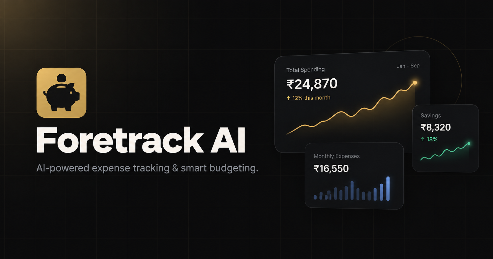

# Foretrack AI

A modern, AI-powered expense tracking and budgeting application built with Next.js, Neon Postgres, Firebase Authentication, and Google Gemini AI. Take control of your finances with smart categorization, personalized insights, and an intelligent financial assistant.

## Features

- Expense tracking — log and categorize expenses with an intuitive interface
- Budget management — set budgets per category and period with visual progress tracking
- Income tracking — track income sources and monitor cash flow
- AI-powered insights — personalized financial insights powered by Google Gemini
- Smart categorization — AI automatically suggests categories based on expense descriptions
- AI financial assistant — chat with an AI assistant about your finances
- Custom categories with icons and colors
- Currency selection — 15+ supported currencies
- Secure authentication — Google sign-in via Firebase with server-verified session cookies
- Cloud storage — all data stored in Neon (serverless PostgreSQL)
- Responsive design across desktop, tablet, and mobile
- Modern UI with smooth animations powered by Framer Motion

## Author

**Ashutosh Swamy**

- [GitHub](https://github.com/ashutoshswamy)
- [LinkedIn](https://linkedin.com/in/ashutoshswamy)
- [X](https://x.com/ashutoshswamy_)
- [Portfolio](https://ashutoshswamy.in)

## License

MIT — see [LICENSE](LICENSE) for details.
